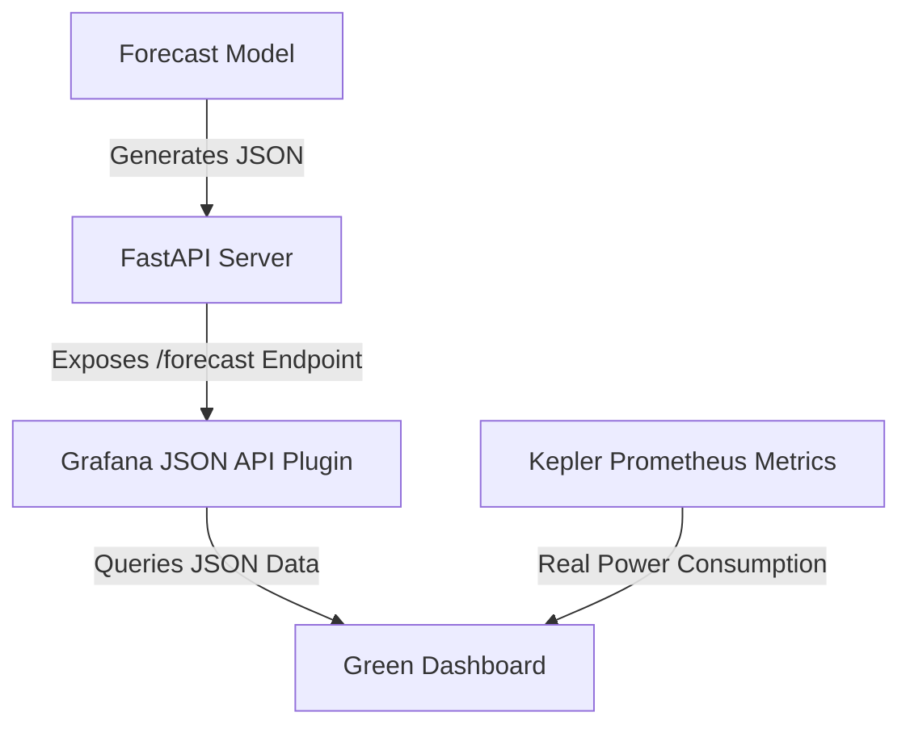

# Grafana Forecasting Integration

This project provides a forecasting service that integrates with Grafana to display energy demand forecasts. It uses historical data to generate forecasts using ARIMA models and exposes them through a JSON API that Grafana can consume.

## Features

- Time series forecasting using ARIMA models
- Grafana JSON API integration
- Fallback mechanisms for robustness
- Configurable time ranges and regions

## Prerequisites

- Python 3.7+
- Grafana 8.0+ with the Grafana JSON Datasource plugin installed

## Installation

1. Clone this repository
2. Install the required Python packages:
   ```
   pip install -r requirements.txt
   ```
3. Install the Grafana JSON Datasource plugin

## Usage

```bash
python forecasting.py
```

The service will start on port 9001 by default. You can configure the port using the `API_PORT` environment variable.

### Configuring Grafana

1. Open Grafana (default: http://localhost:3000)
2. Go to Configuration > Data Sources
3. Add a new data source of type "Grafana JSON Datasource"
4. Set the URL to http://localhost:9001/forecast (or wherever your service is running)
5. Save and test the data source
6. Import the dashboard by going to Create > Import
7. Upload the `grafana_dashboard.json` file or paste its contents
8. Select the JSON data source you created and click Import

## Configuration

The following environment variables can be used to configure the service:

- `API_PORT`: Port for the Grafana JSON API (default: 9001)

## Data Sources

By default, the service uses a mock data source with sample data from a CSV file:

1. Place a CSV file named `carbon_intensity.csv` in the same directory as the script
2. The CSV should have a `start_date` column and columns for each region (e.g., `ISONE`, `CAISO`, etc.)

## Adding More Regions

To add more regions for forecasting:

1. Edit the `self.regions` list in the `ForecastService` class
2. Add the region data to your CSV file if using sample data

## Integrating with Kepler and Green Dashboard

This is a diagram of the integration of the forecasting service with Kepler and the Green Dashboard.


